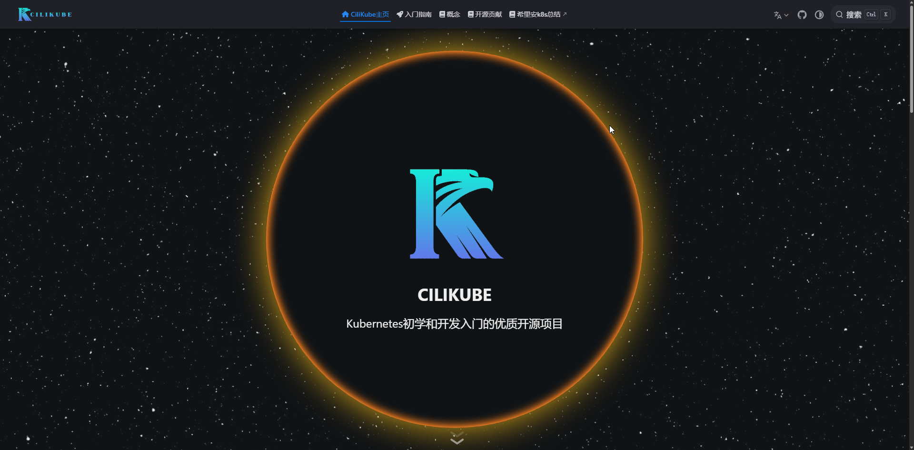

<div align="center">
  
  <h1>CiliKube-Web</h1>
    <p>Open-source Kubernetes Resource Management Platform</p>
    <p>开源 Kubernetes 资源管理平台</p>
</div>


## 🤔 What is CiliKube? | CiliKube 是什么？

CiliKube is an open-source, full-stack Kubernetes (k8s) resource management platform built with modern, mainstream technology stacks (Vue3, TypeScript, Go, Gin). It aims to provide a clean and elegant interface to simplify the daily management (CRUD operations) of Kubernetes resources and support feature expansion.

CiliKube 是一个使用现代主流技术栈（Vue3, TypeScript, Go, Gin）构建的开源全栈 Kubernetes (k8s) 资源管理平台。它致力于提供一个简洁、优雅的界面，来简化 Kubernetes 资源的日常管理（增删改查）并支持功能拓展。


## ✨ What Makes CiliKube Special? | CiliKube 的特色

Unlike complex systems pursuing "large and comprehensive" features, CiliKube focuses on being "small and beautiful." Its core goals are:

1.  **Core Functionality**: Offers a clear, intuitive interface for managing common K8s resources.
2.  **Learning-Friendly**: Features clean code structure and a modern tech stack, making it an excellent starting point for learning **Vue3/Go Web Development** and **custom Kubernetes tooling/development**.
3.  **Easy to Extend**: Designed with extensibility in mind, allowing users to easily add custom features based on their needs.

与追求“大而全”的复杂系统不同，CiliKube 专注于“小而美”。它的核心目标是：

1.  **核心功能**: 提供清晰、直观的界面来管理常用的 K8s 资源。
2.  **学习友好**: 代码结构清晰，技术栈现代，非常适合作为学习 **Vue3/Go Web 开发** 和 **Kubernetes 二次开发** 的入门项目。
3.  **易于拓展**: 预留了自定义功能的空间，方便用户根据自身需求进行扩展。


## 🎯 Target Users | 目标用户

*   Developers looking to learn **Vue3 + TypeScript + ElementPlus** frontend development.
*   Developers looking to learn **Go + Gin** backend development.
*   Cloud-native enthusiasts interested in using the **Kubernetes API** and **client-go**.
*   Teams or individuals needing a concise K8s management dashboard with the potential for customization.
*   希望学习 **Vue3 + TypeScript + ElementPlus** 前端开发的开发者。
*   希望学习 **Go + Gin** 后端开发的开发者。
*   对 **Kubernetes API** 和 **client-go** 使用感兴趣的云原生爱好者。
*   需要一个简洁 K8s 管理面板，并可能进行二次开发的团队或个人。

## 💡 Project Background | 项目背景

CiliKube originated from the author's practical project while learning full-stack web development. During the learning process, the author delved deep into Kubernetes and obtained relevant certifications. This project is not just a demonstration of learning outcomes but also aims to be a "Key," helping more learners like the author open the door to the open-source world, contribute, and grow together.

CiliKube 起源于作者学习 Web 全栈开发的实践项目。在学习过程中，作者深入探索了 Kubernetes，并获得了相关认证。这个项目不仅是学习成果的体现，更希望成为一把“钥匙 (Key)”，帮助更多像作者一样的学习者打开开源世界的大门，参与贡献，共同成长。

## 📚 Documentation | 文档

*   Official Documentation: [cilikube.cillian.website](https://cilikube.cillian.website)
*   官方文档: [cilikube.cillian.website](https://cilikube.cillian.website) 

# Docker Deployment
```angular2html
cd ui
docker build -t "cilikube-fe:latest" .
docker run --name cilikube-fe -p 8888:8888 -d cilikube-fe:latest
```